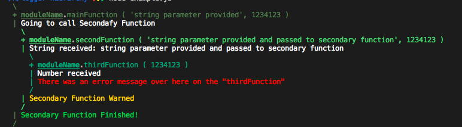
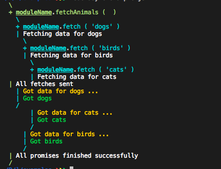

# logger-hierarchy [](https://travis-ci.org/guerrerocarlos/logger-hierarchy)
> Automatic Logging Module

## Install

```
$ npm install logger-hierarchy
```

## Example Usage

```js
const logger = require('logger-hierarchy')('moduleName');

function exampleFunction() {
    var log = logger(arguments); 
    log.printArguments() // Add at the beginning of all functions you want to log

    log.message('Something normal happened')
    log.error('There was a failure')
    log.warning('A friendly warning over here')
    log.success('Important success!')

    log.finished() // Add to the end of all functions you want to log
}

exampleFunction()
```

### Example Output:



## Examples:

Async functions can be logged like this: _/examples/async-example.js_:



## API

### logger(arguments)

#### arguments

Arguments object of the function (JS reserved word), pass it to the logger for function name and parametters logging on the screen

(TODO: Complete API information)

## License

MIT © [Carlos Guerrero](http://carlosguerrero.com/)
